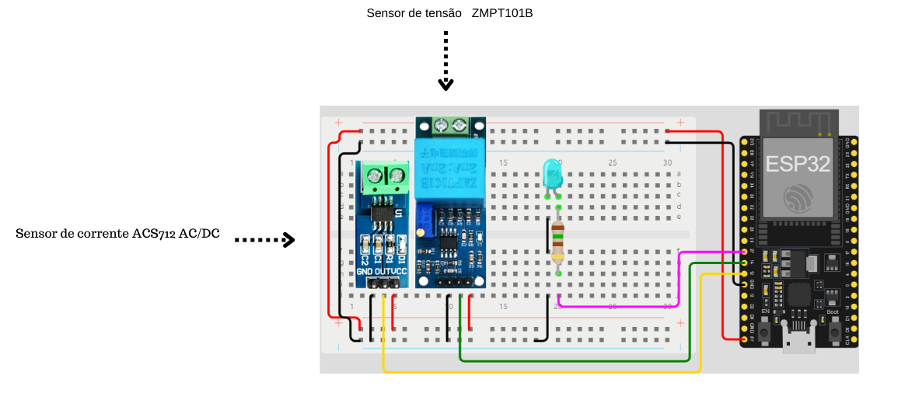

# EcoMonitor
### O projeto “EcoMonitor CTRL Tech” é uma iniciativa inovadora que busca criar um sistema inteligente e sustentável de gestão de energia residencial. O sistema consiste em um conjunto de sensores, dispositivos e software que permitem aos usuários monitorar e controlar o consumo de energia de seus equipamentos domésticos, bem como otimizar o uso de energia de acordo com suas preferências e necessidades.

Para esse projeto vamos utilizar um esp32 para a coleta e filtragem desses dados, para que possamos mandar os dados de forma organizada para o banco de dados
Diagrama eletrico do circuito:

